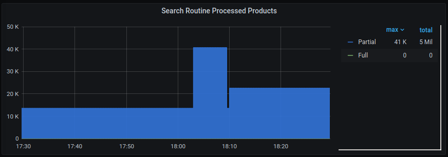

# Conceitos Básicos

Grafana é uma solução de análise e monitoramento que nos ajuda a visualizar, entender as métricas e nos alertar se o parquinho está pegando fogo.

*[Dashboard de métricas da API de busca](http://metrics.core.linximpulse.net/d/ijkMxp4Wk/search-api-by-apikey) para a apikey da casasbahia durante a Black Friday 2020*

Cada um desses gráficos é chamado de Painel e recebe dados de uma única fonte (que pode ser Prometheus, Graphite, AWS CloudWatch, entre outros: clique [aqui](https://grafana.com/docs/grafana/latest/datasources/) para ver mais). Mas o mais utilizado aqui na Linx Impulse é o Prometheus, por isso, precisamos entender um pouco de como essa ferramenta funciona.

## Prometheus

### Metrics e Labels
Metrics (ou métricas) são o conceito chave do Prometheus. Os nossos sistemas como a API de Busca, Rotinas e Data Collection expôem as métricas, e  então o Prometheus os armazenam num banco de dados em formato de [time-series](https://pt.wikipedia.org/wiki/S%C3%A9rie_temporal) de uma forma que é fácil fazer queries para entender como esses sistemas se comportam ao longo do tempo. Por exemplo, http_requests_total é uma métrica que representa o número total de requests para determinado serviço.

Porém, numa típica arquitetura de microserviços, o número de instâncias varia. E para esses casos em que múltiplos serviços expoem a mesma métrica, utilizamos as Labels (ou legendas). Essas legendas são responsáveis por permitirem um modelo de dados ser multidimensional, como este painel de uso de CPU nos clusters da rotina de busca que possui 10 dimensões: uma para cada cluster:

  
*Painel do [dashboard Search Life Guard](http://metrics.core.linximpulse.net/d/odQsFO4Wz/search-life-guard) monitorando o uso de CPU de cada cluster de rotina*

Labels são muito poderosas, nos permitem não só monitorar diversas instâncias no mesmo painel mas também deixam as métricas com nomes mais descritivos e de mais fácil compreensão.

### Tipos de métrica
A biblioteca do Prometheus possui 4 tipos primários de métrica: counters, gauges, histograms e summaries:

- ### Counters  
    Os counters, ou contadores, são uma métrica que só se incrementa (só vai pra cima) e nada mais faz do que contar quantas vezes um evento específico aconteceu. Cada ponto no gráfico é o valor do contador no momento que foi observado.  

    Mas, na prática, o valor absoluto de um contador é irrelevante, pois numa arquitetura de microsserviços as instancias tem uma vida curtíssima e a cada reinicialização zerará o contador. O propósito real de contadores é observar a sua evolução ao longo do tempo, calculando a sua taxa de crescimento.
- ### Gauges  
    Nem todas as métricas podem ser representadas por contadores, já que podem subir ou descer ao longo do tempo. Normalmente, gauges são usados no em caso que uma métrica está expondo o estado atual da aplicação como a quantidade de bytes de memória usada.  

    Diferentemente dos contadores, o valor absoluto de um gauge é relevante e significativo para serem usados diretamente em gráficos e alertas. Também é possível calcular a sua evolução ao longo do tempo, e até mesmo predizer o estado do sistema usando regressão linear.
- ### Histograms
    Quando estamos tentando observar a latência das requests de um serviço, o primeiro pensamento que temos é trabalhar com médias pois são fáceis de calcular ao longo do tempo. Porém, médias possuem uma grande desvantagem nesse caso pois escondem pontos fora da curva que são preocupantes, como requests pontuais que tem uma latência muito alta irão ser 'dissolvidas' na média.  

    [Quantis](https://pt.wikipedia.org/wiki/Quantil) são uma medida melhor para esse tipo de métrica, já que eles nos permitem entender melhor a distribuição. Por exemplo, se a latência num 0.99-quantil (P99) é de 4s, significa que 1% das requests responderam com mais de 4s.  

    Entretanto, quantis são difíceis e caros para calcular precisamente, já que precisam de um set completo de amostras de observações. Histograms torna isso mais simples ao pegar amostras das observações em *buckets* pré-definidos. Por exemplo, um histogram de latência pode ter buckets para <10ms, <100ms, <1s, <10s.
- ### Summaries
    Summaries são muito similares aos Histograms na forma que eles expõem a distribuição de um data set (ambos utilizam quantis). Porém, enquanto os histograms utilizam buckets e estima os quantis no servidor do Prometheus, os summaries são calculados em client side, ou seja, não no servidor do Prometheus.  

    Estes tem a vantagem de serem mais precisos e fiéis à realidade do que os Histograms, porém o cálculo em client-side pode ser muito custoso e até impactar a performance do sistema.  

### Coleta de métricas
A coleta de métricas com o Prometheus funciona num modelo de pull, isto é, o Prometheus é responsável por pegar essas métricas (scraping) dos serviços que ele monitora. Diferentemente de outras ferramentas como o Graphite, que ficam passivamente aguardando que os clientes enviem as métricas para o servidor.

Deixar essa responsabilidade no servidor alivia muito a carga de processamento no cliente ou serviço, deixando-o livre para processar o que realmente importa e não métricas. 

Dessa forma, a única responsabilidade do cliente é expor um endpoint HTTP, normalmente */metrics*, que retorna uma lista de métricas e seus valores. Assim, o servidor do Prometheus processa essa lista em intervalos regulares de tempo.

# Dashboard do time de Customer Operations
Temos um novo dashboard na organização de Customer Operations no Grafana que reúne todas as métricas importantes para a saúde da integração por apikeys.

Clique [aqui](http://metrics.core.linximpulse.net/d/-ZOlvTAMz/apikey-lifeguard?orgId=13) para acessar o dashboard.

Alguns paineis podem estar sem dados mas geralmente isso é por conta daquele produto não estar habilitado para a apikey selecionada.

## Topo

#### **APIKEY**: selecionar a apikey desejada

#### **Events Requests Mean**: quantidade de requests por minuto na [API de eventos]()

#### **Events Succes Ratio**: taxa de sucesso da [API de eventos]()

#### **Search Requests Mean**: quantidade de requests por minuto na [API de busca]()

#### **Search Succes Ratio**: taxa de sucesso da [API de busca]()  

## Eventos

### Views

#### **Page Views by Status Code**: quantidade de [visualizações de todas as páginas](https://docs.linximpulse.com/docs/tagging-all) por [status HTTP](https://developer.mozilla.org/pt-BR/docs/Web/HTTP/Status)

#### **Product Views by Status Code**: quantidade de [visualizações da página de produto](https://docs.linximpulse.com/docs/tagging-product) por [status HTTP](https://developer.mozilla.org/pt-BR/docs/Web/HTTP/Status)

#### **Cart Views by Status Code**: quantidade de [visualizações da página de carrinho](https://docs.linximpulse.com/docs/tagging-cart) por [status HTTP](https://developer.mozilla.org/pt-BR/docs/Web/HTTP/Status)

#### **Transaction Views by Status Code**: quantidade de [visualizações da página de confirmação de compra](https://docs.linximpulse.com/docs/tagging-confirmation) por [status HTTP](https://developer.mozilla.org/pt-BR/docs/Web/HTTP/Status)

#### **Search Views by Status Code**: quantidade de [visualizações da página de busca](https://docs.linximpulse.com/docs/tagging-search) por [status HTTP](https://developer.mozilla.org/pt-BR/docs/Web/HTTP/Status)

#### **Search Views Distribution by Search ID**: quantidade de visualizações confirmadas (com match dos ID's) da página de busca por [status HTTP](https://developer.mozilla.org/pt-BR/docs/Web/HTTP/Status)

### Share

#### **Browser Share**: distribuição (em porcentagem) entre os navegadores utilizados pelos usuários

#### **User Share**: distribuição (em porcentagem) entre usuários anônimos, reais, softs e do cookiepool

## Catálogo

### Newton

#### **Newton Notifications**: quantidade de notificações da apikey no período selecionado

#### **Newton Queue Size**: tamanho da fila

#### **Newton Queue Lag**: atraso na fila do Newton separado por plataformas (VTEX e DCG)

#### **Newton Catalog Requests by Status Code**: quantidade de requests no [servidor de Catálogo]() por [status HTTP](https://developer.mozilla.org/pt-BR/docs/Web/HTTP/Status)

#### **Newton Platform Requests by Status Code**: quantidade de requests no [servidor do Platform]() por [status HTTP](https://developer.mozilla.org/pt-BR/docs/Web/HTTP/Status)

#### **Newton Product Updates Ratio**: taxa de requests retornadas com sucesso x com erros

### Push API

#### **Push API Products by Status Code**: quantidade de requests do tipo *products* na Push API por [status HTTP](https://developer.mozilla.org/pt-BR/docs/Web/HTTP/Status)

#### **Push API Users by Status Code**: quantidade de requests do tipo *users* na Push API por [status HTTP](https://developer.mozilla.org/pt-BR/docs/Web/HTTP/Status)

### Webhooks

#### **Webhooks Invocations**: chamadas no Webhooks

## Busca

### API de Busca

#### **Search API Success Ratio**: taxa de sucesso na API de Busca

#### **Search API Response Time**: tempo de resposta da API de Busca  
:::tip
    P99: se é 2s, por exemplo, significa que 1% das requests estão com o response time de 2s
    P90: se é 1s, por exemplo, significa que 10% das requests estão com o response time de 1s
    Mean: média aritmética dos response times
:::

#### **Search API Requests by Route**: quantidade de requests na API de Busca por rota

#### **Search API Response Time by Route (Mean)**: média de response time da API de Busca por rota

#### **Search API Response Time by Route (P99)**: percentil 99 do response time da API de Busca por rota

### Core da Busca

#### **Search Core Response Time**: tempo de resposta do Core da Busca
:::tip
    P99: se é 2s, por exemplo, significa que 1% das requests estão com o response time de 2s
    P90: se é 1s, por exemplo, significa que 10% das requests estão com o response time de 1s
    Mean: média aritmética dos response times
:::

#### **Search Core Response Time by Service (Mean)**: média de response time do Core da Busca por serviço

#### **Search Core Response Time by Service (P99)**: percentil 99 do response time do Core da Busca por serviço

### Rotinas

#### **Search Routine Processed Products**: status da rotina (0 não está rodando) ou a quantidade de produtos processados no dump

#### **Search Routine Indexed Products**: status da rotina (0 não está rodando) ou quantidade de produtos indexados na busca e a quantidade mínima de produtos a serem indexados

## Vitrines

Em breve...

## Mail

Em breve...

# Usando o Grafana no dia-a-dia do time de Operações
Muitas situações no pool de ATD tem uma análise do Grafana como primeiro passo na investigação do problema, como:

- [Alertas de rotina]()

- [Produto desatualizado na busca]()

- [Problemas de integração base]()

- [Acompanhamento pós-deploy]()

- [Produto desatualizado na base]()